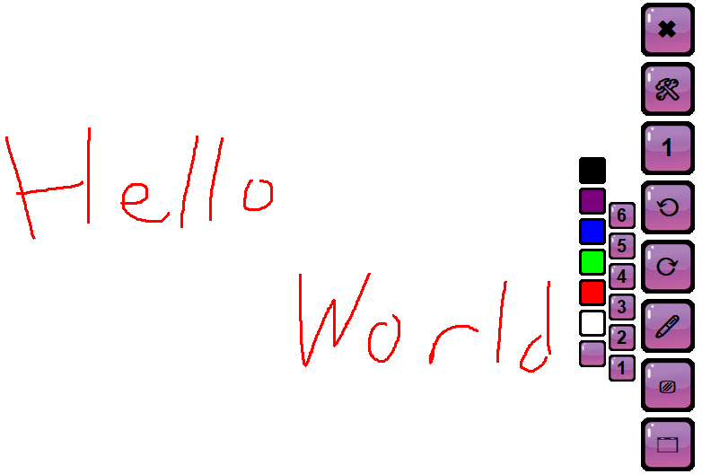

# DeskPainter - A Desktop Drawing Tool

`DeskPainter` is a lightweight desktop application that allows you to draw and annotate anywhere on your screen. It's perfect as an auxiliary tool for teaching, presentations, or screen sharing to help you convey ideas more clearly.



## ✨ Features

*   **Draw Anywhere**: Draw directly over your desktop, unrestricted by application windows.
*   **Pen Tool**:
    *   Offers multiple pen thickness options.
    *   Provides a variety of colors to choose from.
*   **Editing Functions**:
    *   **Undo** the previous action.
    *   **Redo** the next action.
    *   **Clear All** to erase all drawings with a single click.
*   **Screenshot**: Quickly capture the current screen.
*   **Hide Mode**: Temporarily hide the canvas to easily interact with other content on your desktop.
*   **Keyboard Shortcut**: Press the `ESC` key to quickly exit the program.

## 🚀 How to Use

This project requires no complex installation or setup.

1.  Ensure you have a Python environment installed on your computer.
2.  Simply run the `deskpainter_v1.bat` file located in the project's root directory to start the program.

Alternatively, you can launch it via the command line:

```bash
# Navigate to the src directory
cd src

# Run the main script
pythonw main.py
```
